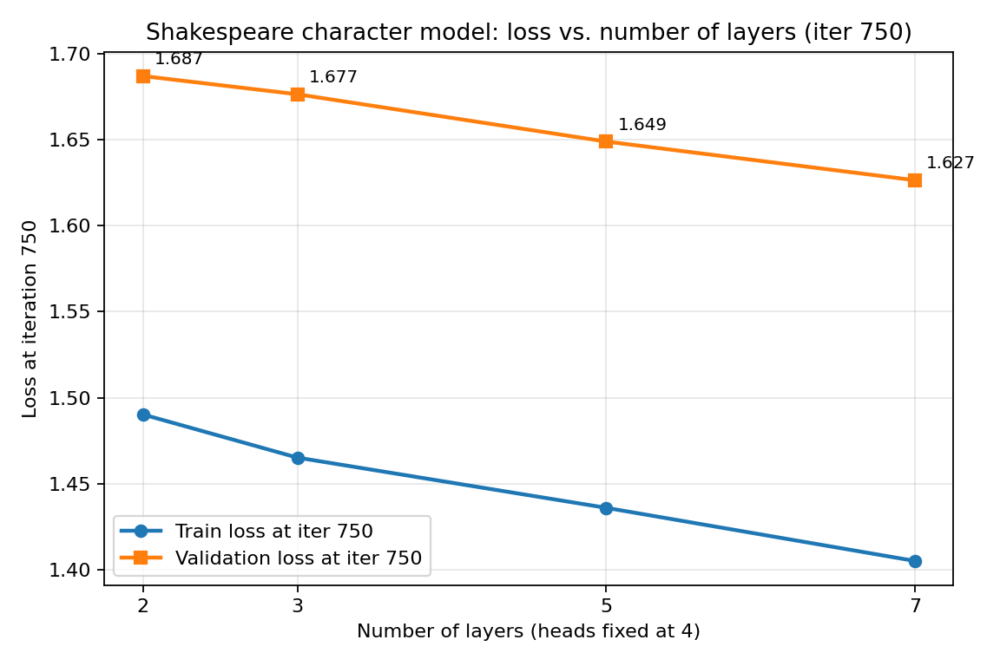
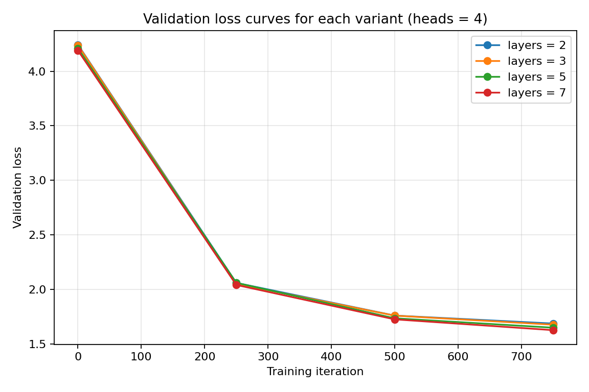

# SEEM3650 Practical Exam Report

**Student ID:** 1155213983  
**Last three digits (XYZ):** 983  
**XYZ mod 4:** 3, so Step 3 fixes heads at 4 and varies layers in {2, 3, 5, 7}.  
**XYZ mod 2:** 1, so Step 4 uses an open-source Python code corpus.  
**Generated at:** 2026-04-30 10:42 UTC

## Step 2: Shakespeare character-level model

The first five lines of the generated Shakespeare sample are:

```text
ANGELO:
And cowards it not so, and to Barnardine.
On this all and barriage out of her back:
As was, away, with his action our tongue.

```

## Step 3: Architecture exploration

Heads were fixed at **4**, and layers were varied over **[2, 3, 5, 7]**. The iteration target was **750** for every run.

| Layers | Heads | Step | Train loss | Validation loss | Runtime (min) | Configuration file |
| -----: | ----: | ---: | ---------: | --------------: | ------------: | :----------------- |
| 2 | 4 | 750 | 1.4902 | 1.6871 | 3.0 | `config/train_shakespeare_char_l2_h4.py` |
| 3 | 4 | 750 | 1.4651 | 1.6765 | 4.4 | `config/train_shakespeare_char_l3_h4.py` |
| 5 | 4 | 750 | 1.4359 | 1.6490 | 7.2 | `config/train_shakespeare_char_l5_h4.py` |
| 7 | 4 | 750 | 1.4050 | 1.6265 | 10.0 | `config/train_shakespeare_char_l7_h4.py` |

**Lowest validation loss:** `1.6265` with **layers = 7**, **heads = 4**, and **n_embd = 384**.





### Discussion

Validation loss decreased monotonically as the number of layers grew from 2 to 7, suggesting that the Shakespeare character-level task benefits from additional depth under the 750-iteration budget.

The validation losses across layers spanned a range of `0.0606`, with the shallowest model (layers = 2) reaching `1.6871` and the deepest model (layers = 7) reaching `1.6265`.

The largest absolute train/validation gap was `-0.2215` at layers = 7. A negative or near-zero gap suggests the model was still under-trained for that capacity, while a strongly positive gap suggests early overfitting under the 750-iteration budget.

The longest single training run took **10.0 minutes**, which stays within the 10-minute-per-run budget required by the assignment.

## Step 4: Code-generation BabyGPT

The code-generation corpus is concatenated from open-source Python files from the following GitHub projects:

- **CPython standard library** (PSF License)
- **Flask** (BSD-3-Clause)
- **Requests** (Apache-2.0)

After running `data/code_generation/prepare.py`, the corpus contains **572,125** character-level tokens, exceeding the 100,000-token minimum required by the assignment. The training split has **514,912** tokens, the validation split has **57,213** tokens, and the character-level vocabulary size is **100**.

The final code-generation evaluation at step **2000** was train loss `0.1402` and validation loss `1.6525`. The code-generation training run took **23.0 minutes**.

The first 20 lines below are reproduced verbatim from `samples/code_generation_full.txt`. They span the end of the first generated sample and the start of the second; the literal `---------------` is the sample separator emitted by `sample.py` between successive samples.

### First 20 lines of generated code

```python
def __init__(self, **kwds):
        return self.ctx.__init__()

def _field_list(self, ctx, fields):
    def __init__(self, fieldnames, cls.__dict__(self, fieldnames):
        ""Return in self.endpoint for action.

          If a cts action the sample consumed from test discriptor a from the given that wone
          .. versionadded::: 00
                                        median(repr()))

                                             break

                                            # pup headed for whitespace
                                                                                          # default the value not be itempter the default values default
                                           )

                                          self.add_atttempt(('name)) = argument % tu
---------------
def __wataclass_getitlestic__()
```

### Favourite generated snippet

```python
def __init__(self, **kwds):
        return self.ctx.__init__()

def _field_list(self, ctx, fields):
    def __init__(self, fieldnames, cls.__dict__(self, fieldnames):
        ""Return in self.endpoint for action.

          If a cts action the sample consumed from test discriptor a from the given that wone
          .. versionadded::: 00
                                        median(repr()))

                                             break

                                            # pup headed for whitespace
                                                                                          # default the value not be itempter the default values default
                                           )

                                          self.add_atttempt(('name)) = argument % tu
```

### Discussion

The code-generation samples were produced with the prompt `def ` and the default sampling temperature of 0.8. They typically reproduce surface-level Python syntax such as `def`, `return`, `if`, `for`, `import`, indentation, parentheses, and identifier-like tokens, even though the character-level model has no understanding of executable semantics. This behaviour is consistent with what a 2000-iteration character-level BabyGPT can reasonably learn from a corpus of this size.
